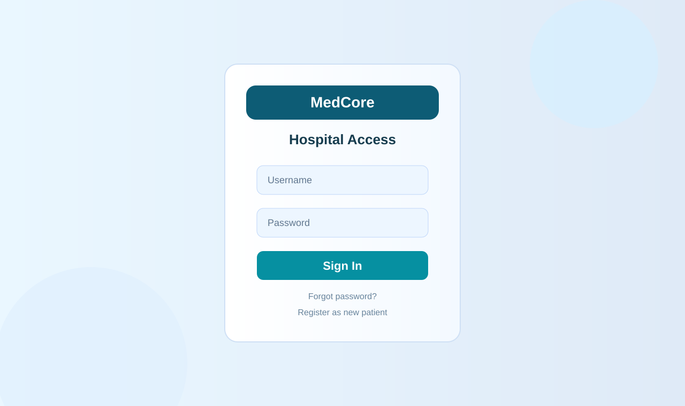
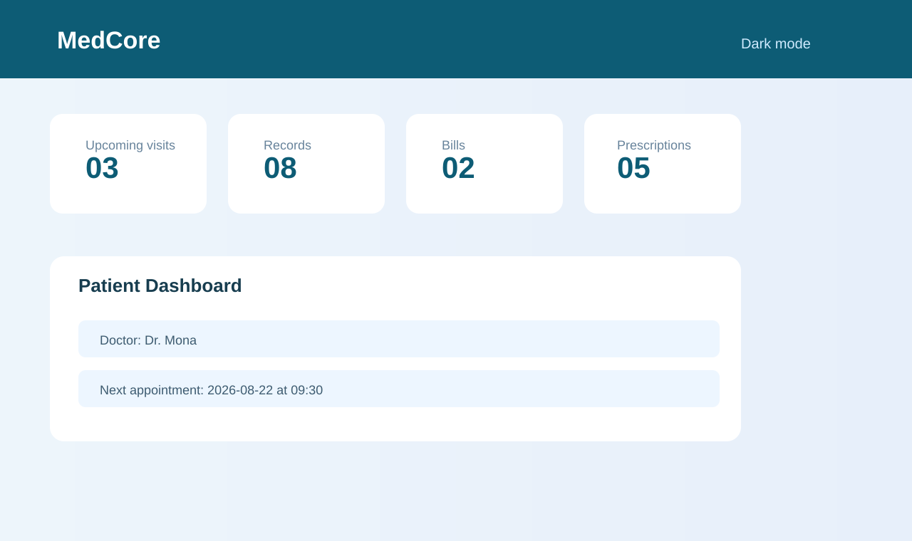

# MedCore

A modern Qt6 hospital management system for administrators, doctors, receptionists, and patients.

MedCore helps manage appointments, patient records, prescriptions, departments, and billing in a single hospital-focused workflow.

## Overview

MedCore is a hospital operations dashboard built in C++ with Qt 6. It demonstrates a layered architecture: GUI, application/controller logic, domain model, and file-based persistence. The project is designed to run as a desktop clinical management interface while keeping business logic separate from GUI code.

## Why this project matters

Hospital systems must be clear, role-aware, and trustworthy. MedCore focuses on four common user roles:
- Admin: manages system setup and staff
- Doctor: views patient records and updates treatment plans
- Receptionist: manages appointments
- Patient: views profile and booking information

The app is structured to reflect a realistic hospital workflow while keeping the codebase suitable for OOP coursework and demonstration.

## Features

- Role-based login and dashboard routing
- Appointment booking, cancellation, and rescheduling
- Patient search and doctor search
- Medical record updates and prescription writing
- Billing and payment handling
- Department management
- File-based persistence and data reload
- Modern, hospital-themed Qt user interface with dark mode support
- Headless test coverage for core operations and persistence

## Architecture

MedCore follows a layered design:

```text
Qt GUI
  ↓
ApplicationManager / Controllers
  ↓
Operations
  ↓
Domain classes (User, Doctor, Admin, Receptionist, Patient, PatientRecord)
  ↓
FileManager
  ↓
Data files
```

This keeps the UI focused on interaction and leaves domain rules in the application layer.

## OOP concepts used

- Encapsulation: data and business logic are kept in model and operation classes
- Inheritance: Admin, Doctor, Receptionist, and Patient inherit from User
- Polymorphism: role-based routing uses virtual GetRole() and shared user APIs
- Composition: Patient owns a PatientRecord for patient-specific information
- Separation of concerns: GUI, operations, and persistence are split into distinct layers

## Technologies

- C++17
- Qt 6
- CMake
- File-based persistence (TXT data layer)
- Unit-style test suite for operation logic

## Project structure

```text
MedCore/
├── include/               Header files for domain and operations
├── src/                  Core implementation and persistence
├── gui/                  Qt widgets and dashboards
├── tests/                Automated tests
├── data/                 Seed data and runtime data
├── docs/                 Documentation and screenshots
├── CMakeLists.txt        Build config
├── README.md             Project overview and usage
├── LICENSE               MIT license
├── .gitignore            Ignore build artifacts
└── .github/workflows/    CI config
```

## Build and run

Requirements:
- CMake
- C++17 compiler
- Qt 6 installed and discoverable by CMake

Build:

```bash
cmake -S . -B build
cmake --build build
```

Run GUI:

```bash
./build/medcore_gui
```

Run tests:

```bash
ctest --test-dir build --output-on-failure
```

## Login credentials

The application seeds example users for demonstration purposes:
- Admin: `admin` / `admin123`
- Doctor: `dr.mona` / `doc123`
- Receptionist: `reception1` / `rec123`
- Patient: `sara.p` / `pat123`

These are sample accounts for local demo use only.

## Screenshots

The project includes a lightweight visual mockup of the main UI in the repo so the public README is complete even before a full screen capture is attached.





## UML and docs

Project documentation and checklist files are included in the `docs/` folder.
- `docs/CHECKLIST.md` — pre-submission checklist and final verification notes
- `docs/screenshots/` — visual placeholders for public-facing showcase materials

## Testing

The project includes headless operation tests that exercise core workflows such as:
- login success/failure
- patient registration
- appointment booking
- persistence round trips
- validation and conflict handling

## Future enhancements

Planned improvements for a production-grade release:
- switch password storage to bcrypt/argon2 with random per-user salts
- add stronger database persistence and validation layers
- improve role-based authorization enforcement in the backend
- add richer analytics, reporting, and patient messaging
- package a proper installer and release build pipeline

## License

MIT License.

## Project tagline

MedCore: streamlined hospital operations, designed for real-world care coordination and modern healthcare workflows.
